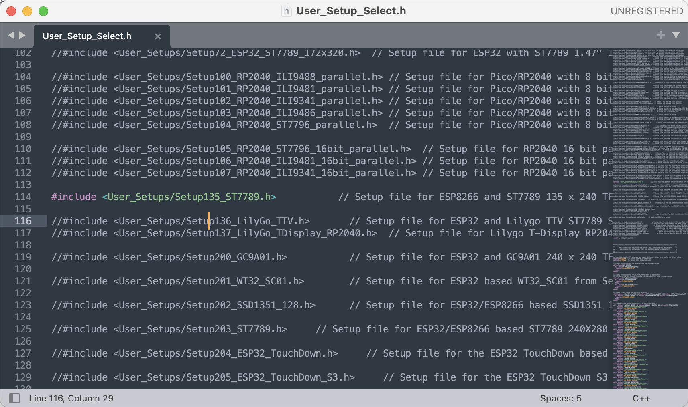
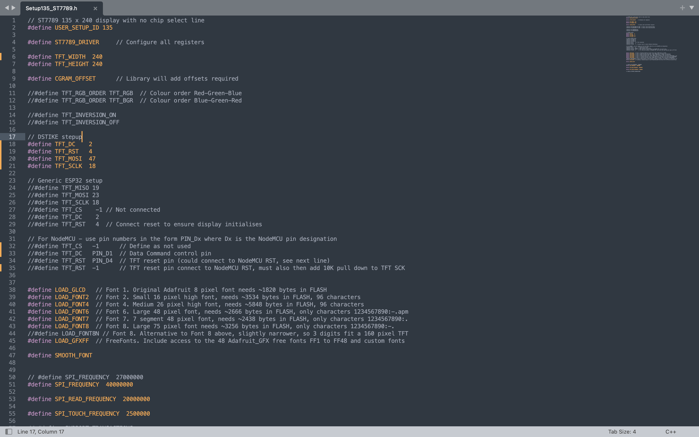

# TFT_eSPI库驱动LCD使用说明

## 引脚接线
```
// DSTIKE stepup
#define TFT_DC    2
#define TFT_RST   4
#define TFT_MOSI  47 //因为板子没有23引脚，被迫随机选了一个
#define TFT_SCLK  18
```

## 修改库文件里的配置
* TFT_eSPI库文件目录： /Users/smb/Documents/Arduino/libraries/TFT_eSPI

* 修改头文件User_Setup_Select.h里的配置，选择对应屏幕的头文件


* 修改头文件User_Setups/Setup135_ST7789.h里的配置

* 修改分辨率
```
#define TFT_WIDTH  240
#define TFT_HEIGHT 240
```
* 修改引脚连接
```
// DSTIKE stepup
#define TFT_DC    2
#define TFT_RST   4
#define TFT_MOSI  47
#define TFT_SCLK  18
```